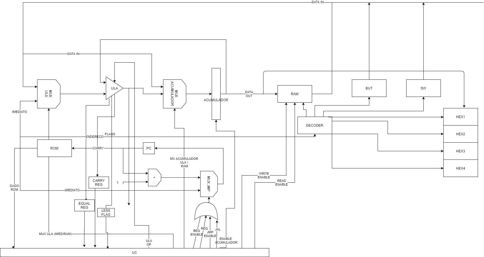

# Calculadora

Arquitetura: Acumulador


### Instrução


```
SEM USO (3 bits) | IMEDIATO \ ENDRERECO ( 8 bits) | INSTRUC (5 bits)
```


### Pontos de controle


|INST | ENABLE RETURN | ENABLE JUMP AND LINK | ULA OP (4 bits) | RAM WE | RAM RE | BRANCH GREATER | ACUM MUX(2bit) | ENABLE ACUMULADOR | SEL MUX / ULA | BEQ | JMP |
| ------------- | ------------- | ------------- | ------------- | ------------- | ------------- | ------------- | ------------- | ------------- | ------------- | ------------- | ------------- |
| REQ | 1 | 0 | 0000 | 0 | 0 | 0 | 00 | 0 | 0 | 0 | 0 |
| JAL | 0 | 1 | 0000 | 0 | 0 | 0 | 00 | 0 | 0 | 0 | 0 |
| LOAD | 0 | 0 | 0000 | 0 | 0 | 0 | 10 | 1 | 0 | 0 | 0 |
| CMP | 0 | 0 | 0111 | 0 | 0 | 0 | 01 | 0 | 1 | 0 | 0 |
| ADD | 0 | 0 | 0001 | 1 | 0 | 0 | 01 | 1 | 0 | 0 | 0 |
| SUB | 0 | 0 | 0010 | 1 | 0 | 0 | 01 | 1 | 0 | 0 | 0 |
| AND | 0 | 0 | 0011 | 1 | 0 | 0 | 01 | 1 | 0 | 0 | 0 |
| OR | 0 | 0 | 0100 | 1 | 0 | 0 | 01 | 1 | 0 | 0 | 0 |
| XOR | 0 | 0 | 0110 | 1 | 0 | 0 | 01 | 1 | 0 | 0 | 0 |
| NOT | 0 | 0 | 0101 | 1 | 0 | 0 | 01 | 1 | 0 | 0 | 0 |
| STORE | 0 | 0 | 0000 | 0 | 1 | 0 | 00 | 0 | 0 | 0 | 0 |
| LOAD | 0 | 0 | 0000 | 1 | 0 | 0 | 00 | 1 | 0 | 0 | 0 |
| BGT | 0 | 0 | 0000 | 0 | 0 | 1 | 00 | 0 | 0 | 0 | 0 |
| JMP | 0 | 0 | 0000 | 0 | 0 | 0 | 00 | 0 | 0 | 1 | 0 |
| BEQ | 0 | 0 | 0000 | 0 | 0 | 0 | 00 | 0 | 0 | 0 | 1 |
| ADDI | 0 | 0 | 0001 | 1 | 0 | 0 | 01 | 1 | 1 | 0 | 0 |
| LOADC | 0 | 0 | 0000 | 0 | 0 | 0 | 10 | 1 | 0 | 0 | 0 | 
| LOADI | 0 | 0 | 0000 | 0 | 0 | 0 | 11 | 1 | 0 | 0 | 0 |
| CMM | 0 | 0 | 0111 | 0 | 0 | 0 | 01 | 0 | 0 | 0 | 0 |


### Decodificador

| Periferico | Paginacao ( 5 downto 4 ) | endereco (2 downto 0) |
| ---------- | --------- | -------- |
| chaves numero menos significativa [SW(7 downto 0)] | 10 | 000 |
| chaves numero mais significativa [SW(15 downto 8)] | 10 | 001 |
| chaves numero modo calculadora  [SW(17 downto 15)] | 10 | 010 |
| botao de confirmacao  [KEY(0)] | 10 | 011 |
| display hexadecimal 0 | 11 | 100 |
| display hexadecimal 1 | 11 | 101 |
| display hexadecimal 2 | 11 | 110 |
| display hexadecimal 3 | 11 | 111 |





